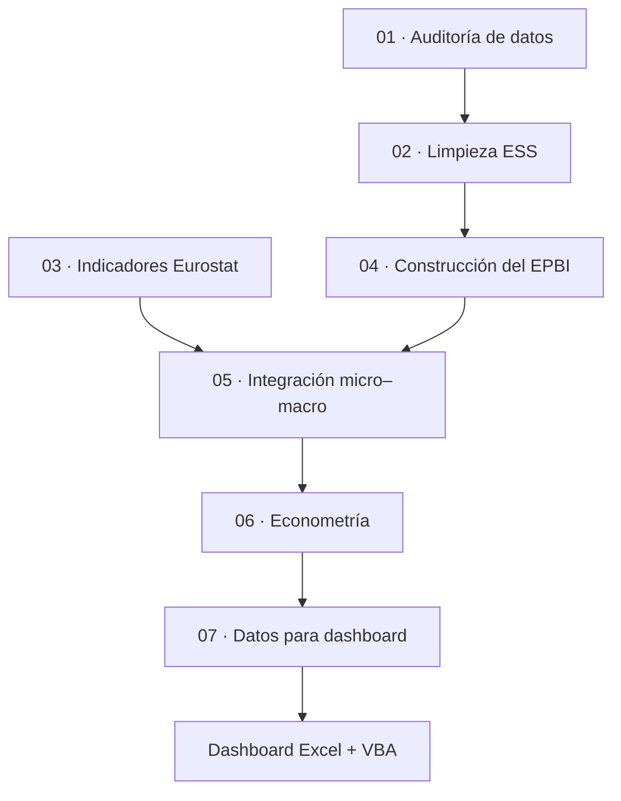

<div align="center">

# Economic Perception Bias Index (EPBI)

**Percepción económica, posición objetiva e integración micro–macro con ESS y Eurostat**


</div>

> [!IMPORTANT]
> **Unidad de análisis:** individuo entrevistado en la ESS.  
> **Estimación principal:** WLS con pesos ESS, efectos fijos de país y ronda, y errores estándar agrupados por país-ronda.  
> **Cobertura del EPBI:** desde la ronda 4 (2008).

## El proyecto de un vistazo

| Dimensión | Resultado | Dimensión | Resultado |
| --- | ---: | --- | ---: |
| Observaciones fuente ESS | **540.671** | Países en la fuente | **39** |
| EPBI válido | **318.560** | Rondas analizadas en M1/M2 | **8** |
| Observaciones en M1/M2 | **271.652** | Clusters país-ronda | **214** |
| Modelo individual principal | **M2** | Dashboard final | **Excel + VBA** |

### Qué hace este repositorio

Construye un indicador individual de discrepancia entre una **posición económica objetiva aproximada** y la **percepción subjetiva de la situación económica**, lo integra con contexto macroeconómico de Eurostat y estima asociaciones mediante un pipeline reproducible en Python.

### Navegación

| Sección | Contenido |
| --- | --- |
| [Visión general](#visión-general) | Objetivo, unidad de análisis y arquitectura del pipeline |
| [Datos y construcción del EPBI](#datos-y-construcción-del-epbi) | ESS, Eurostat, pesos, cobertura temporal e índice |
| [Estrategia y resultados econométricos](#estrategia-y-resultados-econométricos) | Modelos, inferencia, diagnósticos y resultados |
| [Implementación y dashboard](#implementación-y-dashboard) | Notebooks, salidas y estructura del dashboard |
| [Interpretación y reproducibilidad](#interpretación-y-reproducibilidad) | Lectura de coeficientes, ejecución y dependencias |
| [Limitaciones, extensiones y cierre](#limitaciones-extensiones-y-cierre) | Limitaciones, líneas futuras y conclusiones |

---

## Visión general

### 1. Resumen ejecutivo

Este proyecto desarrolla un flujo de trabajo reproducible para construir
y analizar el **Economic Perception Bias Index (EPBI)** mediante la
integración de microdatos de la **European Social Survey (ESS)** con
indicadores macroeconómicos de **Eurostat**.

El EPBI mide, a nivel individual, la diferencia entre una aproximación
normalizada a la posición económica objetiva del hogar y la valoración
subjetiva que el entrevistado realiza de su situación económica. El
análisis econométrico mantiene al **individuo como unidad de
observación**. Los indicadores macroeconómicos se incorporan como
variables contextuales país-año y, por tanto, se repiten entre los
individuos pertenecientes al mismo contexto.

El proyecto se estructura en siete notebooks de Jupyter:

1.  auditoría de los microdatos;
2.  limpieza y preparación de la ESS;
3.  preparación de indicadores Eurostat;
4.  construcción del EPBI y variables derivadas;
5.  integración micro-macro;
6.  estimación econométrica;
7.  preparación de datos para un dashboard final en Microsoft Excel.

El dashboard definitivo se ha desarrollado en **Excel con VBA**,
utilizando los datos preparados por el notebook 07.

Los principios del proyecto son:

- reproducibilidad;
- modularidad;
- trazabilidad;
- simplicidad del pipeline;
- persistencia eficiente mediante Parquet;
- separación entre datos procesados, resultados econométricos y
  presentación final.

### 2. Objetivo

El objetivo general es estudiar si existen diferencias sistemáticas
entre la posición económica objetiva aproximada de los individuos y la
percepción subjetiva que tienen de su situación, así como analizar qué
características individuales y contextuales están asociadas con esas
diferencias.

Los objetivos específicos son:

- auditar y validar los microdatos ESS;
- construir una muestra temporalmente homogénea para el EPBI;
- aplicar correctamente los pesos de análisis de la ESS;
- procesar indicadores socioeconómicos de Eurostat;
- construir el EPBI a nivel individual;
- integrar la información individual con el contexto macroeconómico;
- estimar modelos econométricos ponderados con efectos fijos;
- evaluar la robustez de la inferencia;
- comunicar los resultados mediante un dashboard interactivo en Excel.

### 3. Unidad de análisis y estructura de los datos

La ESS no sigue longitudinalmente a los mismos individuos. Cada ronda
contiene una nueva muestra transversal.

Por ello, el proyecto utiliza **cortes transversales repetidos**, pero
la unidad de observación de la base econométrica final es el **individuo
entrevistado**, no el agregado país-ronda.

Una fila del panel micro-macro corresponde a:

> un entrevistado ESS + sus características individuales + el EPBI
> individual + el contexto macroeconómico de su país y año.

Las variables macroeconómicas se repiten para todos los individuos
pertenecientes al mismo país y periodo.

De forma esquemática, una especificación puede expresarse como:

$$
EPBI_i = \beta_0 + \beta_1 X_i + \beta_2 Z_{ct} + \mathrm{FE}_c + \mathrm{FE}_t + \varepsilon_i
$$

donde:

- $X_i$ representa las características individuales;
- $Z_{ct}$ representa las variables contextuales del país $c$ en el periodo $t$;
- $\mathrm{FE}_c$ representa los efectos fijos de país;
- $\mathrm{FE}_t$ representa los efectos fijos de ronda.

> [!IMPORTANT]
> El proyecto **no estima los modelos principales sobre una base previamente agregada país-ronda**. La unidad econométrica final sigue siendo el individuo.

### 4. Arquitectura del pipeline



**Secuencia de ejecución:** `01 → 02 → 03 → 04 → 05 → 06 → 07`

> [!NOTE]
> No existe un notebook `00` de configuración. La ejecución comienza en `01_DATA_AUDIT`.

---

## Datos y construcción del EPBI

### 5. Fuentes de datos

#### 5.1 European Social Survey

La ESS proporciona los microdatos individuales utilizados para construir
el EPBI y las variables explicativas.

El archivo de trabajo contiene:

- **540.671 observaciones**;
- **2.752 columnas** en el fichero fuente auditado;
- **39 países**;
- **11 rondas**.

No se detectaron duplicados completos en la auditoría inicial.

#### 5.2 Eurostat

Eurostat proporciona los indicadores contextuales armonizados utilizados
para caracterizar las condiciones económicas de cada país.

El panel macroeconómico conserva datos de **2007 a 2024** para permitir
un emparejamiento temporal exacto o, cuando sea necesario, mediante un
margen máximo de ±1 año.

### 6. Variables ESS utilizadas

Las siguientes variables se utilizan o se conservan a lo largo del pipeline, ya sea para
identificación, ponderación, construcción del índice, modelización, diagnóstico o
trazabilidad.

#### Identificación

- `idno`
- `cntry`
- `essround`
- `edition`
- `proddate`
- `survey_year`
- `country_round_id`
- `respondent_id`

#### Pesos y diseño

- `dweight`
- `pspwght`
- `pweight`
- `anweight`
- `psu`
- `stratum`
- `analysis_weight`
- `analysis_weight_source`

`psu` y `stratum` se conservan por trazabilidad, pero el PSU no se
utiliza en la inferencia econométrica final.

#### Sociodemográficas

- `agea`
- `gndr`
- `eisced`
- `eduyrs`
- `mnactic`
- `hhmmb`

#### Económicas

- `hinctnta`
- `hincfel`

#### Actitudinales e institucionales

- `lrscale`
- `gincdif`
- `ppltrst`
- `trstprl`
- `trstplt`
- `stfdem`
- `stfeco`
- `stflife`

### 7. Codificaciones principales

#### Sexo

- `gndr = 1` → Hombre
- `gndr = 2` → Mujer

#### Educación EISCED

| Código | Categoría                                    |
|-------:|----------------------------------------------|
|      0 | Menor que educación primaria                 |
|      1 | Educación primaria                           |
|      2 | Educación baja o primera etapa de secundaria |
|      3 | Educación secundaria superior                |
|      4 | Educación post-secundaria no terciaria       |
|      5 | Educación terciaria de ciclo corto           |
|      6 | Grado universitario o equivalente            |
|      7 | Maestría, doctorado o educación superior     |

Los códigos 0–7 son válidos. Los códigos especiales 55, 77, 88 y 99 se
tratan como valores ausentes.

#### Actividad principal

En la modelización se utiliza `mnactic` como variable categórica:

| Código | Categoría                            |
|-------:|--------------------------------------|
|      1 | Trabajo remunerado                   |
|      2 | Educación / estudiante               |
|      3 | Desempleado, buscando trabajo        |
|      4 | Desempleado, no buscando trabajo     |
|      5 | Enfermedad o discapacidad permanente |
|      6 | Jubilado                             |
|      7 | Servicio comunitario o militar       |
|      8 | Tareas del hogar / cuidados          |
|      9 | Otra actividad                       |

### 8. Pesos ESS

La estrategia de ponderación sigue la guía oficial de la ESS.

La variable utilizada en el análisis es `analysis_weight`.

Regla de construcción:

1.  utilizar `anweight` cuando existe y es positivo;
2.  cuando no está disponible, utilizar:

```python
analysis_weight = pspwght * pweight
```

No se utiliza un peso unitario como valor de sustitución.

`analysis_weight_source` documenta el origen del peso aplicado a cada
observación.

El peso se utiliza en:

- agregaciones descriptivas;
- medias ponderadas;
- estimación WLS.

El EPBI individual **no se multiplica por el peso para redefinir el
índice**.

Por ejemplo, la media ponderada del EPBI para un país-periodo es:

$$
\overline{EPBI}^{\,w}_{ct} = \frac{\sum_{i \in (c,t)} w_i \, EPBI_i}{\sum_{i \in (c,t)} w_i}
$$

donde $w_i$ representa `analysis_weight`.

### 9. Cobertura temporal del EPBI

La auditoría confirmó que `hinctnta`, variable necesaria para construir
la posición objetiva, no está disponible en las rondas 1–3.

Por razones de homogeneidad y simplicidad metodológica, **no se armoniza
la antigua variable `hinctnt`**.

En consecuencia, el análisis del EPBI comienza en:

> **Ronda 4 (2008)**

Las rondas 1, 2 y 3 quedan excluidas del análisis EPBI.

Además, se detectaron combinaciones país-ronda posteriores sin
información utilizable para construir el índice:

- Bulgaria — 2008;
- Chipre — 2008;
- Eslovaquia — 2008;
- Portugal — 2010;
- Estonia — 2014.

Estas combinaciones se excluyen en la limpieza.

Dentro de las combinaciones país-ronda válidas pueden existir individuos
sin alguno de los dos componentes necesarios para calcular el EPBI. Esos individuos se conservan por
trazabilidad, pero su `epbi` queda como ausente y no forman parte de los
análisis que requieren un EPBI válido.

### 10. Construcción del EPBI

El EPBI se construye a partir de:

- `hinctnta`: decil/categoría de renta del hogar;
- `hincfel`: valoración subjetiva de la situación económica del hogar.

#### 10.1 Posición objetiva

```python
objective_position = (hinctnta - 1) / 9
```

Transforma las categorías 1–10 a una escala 0–1.

La ESS no proporciona en este fichero una medida de renta equivalente
del hogar que permita reconstruir un percentil de renta equivalente. Por
ello, `objective_position` debe interpretarse como una **aproximación
normalizada basada en el decil/categoría de renta declarada**, no como
un percentil exacto de renta equivalente.

`hhmmb` no forma parte de la construcción del EPBI.

#### 10.2 Posición subjetiva

`hincfel` está codificada originalmente de forma que valores bajos
representan una situación más favorable.

Se invierte:

```python
hincfel_positive = 5 - hincfel
```

y se normaliza:

```python
subjective_position = (hincfel_positive - 1) / 3
```

Equivalencias:

| `hincfel` | Interpretación            | Posición subjetiva |
|----------:|---------------------------|-------------------:|
|         1 | Vive cómodamente          |               1,00 |
|         2 | Se las arregla            |               0,67 |
|         3 | Tiene dificultades        |               0,33 |
|         4 | Tiene muchas dificultades |               0,00 |

#### 10.3 Índice

```python
epbi = subjective_position - objective_position
epbi_abs = abs(epbi)
```

Interpretación:

- `EPBI > 0`: percepción relativamente más favorable que la posición
  objetiva aproximada;
- `EPBI < 0`: percepción relativamente menos favorable;
- `EPBI ≈ 0`: mayor alineamiento entre ambas dimensiones.

#### 10.4 Categorías

- `EPBI < -0.15` → Subestimación
- `-0.15 ≤ EPBI ≤ 0.15` → Ajuste
- `EPBI > 0.15` → Sobreestimación

### 11. Resultados de construcción del EPBI

En el notebook 04 se obtuvieron:

| Indicador                 | Resultado |
|---------------------------|----------:|
| Posición objetiva válida  |   319.430 |
| Posición subjetiva válida |   392.222 |
| EPBI válido               |   318.560 |
| EPBI absoluto válido      |   318.560 |
| EPBI no calculable        |    79.759 |
| Media posición objetiva   |  0,473389 |
| Media posición subjetiva  |  0,650592 |
| Media EPBI                |  0,178412 |
| Media EPBI absoluto       |  0,277497 |

Estos valores son resultados descriptivos del proceso de construcción y
no sustituyen las estimaciones ponderadas utilizadas cuando corresponde.

### 12. Indicadores Eurostat

El notebook 03 construye un panel con los siguientes indicadores:

- `renta_media_eur`
- `ratio_quintiles_renta`
- `gini`
- `gini_antes_transferencias`
- `gini_pensiones_transferencias`
- `riesgo_pobreza`
- `brecha_pobreza`
- `sobrecarga_vivienda`
- `privacion_material_social_severa`
- `ratio_renta_mayores`

Los cinco indicadores contextuales utilizados finalmente en los modelos
econométricos son:

- Gini;
- riesgo de pobreza;
- privación material y social severa;
- sobrecarga del coste de la vivienda;
- renta media.

### 13. Integración ESS–Eurostat

La integración se realiza **indicador por indicador**.

Regla temporal:

1.  se busca el valor del mismo país en el año ESS;
2.  si no existe, se permite el año disponible más cercano dentro de ±1
    año;
3.  en caso de empate, se prioriza el año anterior.

Para cada indicador se conservan variables de trazabilidad:

- `<variable>_year_used`
- `<variable>_year_diff`
- `<variable>_match`

Además se generan:

- `macro_disponible`
- `macro_completo`

La integración preserva una fila por entrevistado.

Los indicadores macroeconómicos están repetidos en los microdatos para
todos los entrevistados del mismo contexto. Por ello, **no deben sumarse
ni ponderarse como si fueran variables individuales**.

---

## Estrategia y resultados econométricos

### 14. Estrategia econométrica

#### 14.1 Variable dependiente

La variable dependiente es `epbi`, definida a nivel individual.

#### 14.2 Variables individuales

##### Sociodemográficas

- sexo (`gndr`);
- edad (`agea`);
- educación (`eisced`);
- actividad principal (`mnactic`).

##### Ideológicas e institucionales

- ideología izquierda-derecha (`lrscale`);
- actitud redistributiva (`gincdif`);
- confianza en políticos (`trstplt`);
- satisfacción con la democracia (`stfdem`).

#### 14.3 Variables macroeconómicas

- `gini`
- `riesgo_pobreza`
- `privacion_material_social_severa`
- `sobrecarga_vivienda`
- `renta_media_eur`

La renta media se expresa en miles de euros en la especificación
econométrica.

#### 14.4 Efectos fijos

Todos los modelos principales incorporan:

- efectos fijos de país;
- efectos fijos de ronda.

#### 14.5 Estimador

Se utiliza **Weighted Least Squares (WLS)** con `analysis_weight`.

### 15. Tratamiento de la edad

Se compararon cuatro especificaciones sobre una muestra común:

| Especificación | R² ajustado |        AIC |        BIC |
|----------------|------------:|-----------:|-----------:|
| Lineal         |     0,19495 |     279451 |     280145 |
| Cuadrática     |     0,20385 |     276432 |     277136 |
| Grupos         |     0,20530 |     275935 |     276682 |
| Spline cúbico  | **0,20764** | **275139** | **275875** |

Error medio absoluto del patrón residual por edad:

| Especificación |        MAE |
|----------------|-----------:|
| Lineal         |     0,0394 |
| Cuadrática     |     0,0218 |
| Grupos         |     0,0245 |
| Spline         | **0,0158** |

Por ello, la especificación final utiliza un **spline cúbico con 5
grados de libertad**.

Los grupos de edad se conservan únicamente para visualización
descriptiva en el dashboard.

### 16. Modelos finales

#### M1 — Sociodemográfico

Incluye:

- sexo;
- spline de edad;
- educación;
- actividad principal;
- efectos fijos de país y ronda.

#### M2 — Individual completo

Añade a M1:

- ideología;
- actitud redistributiva;
- confianza en políticos;
- satisfacción democrática.

Es el **modelo individual principal**.

#### M3 — Contexto macroeconómico

Se estiman cinco modelos separados para evitar que la fuerte correlación
entre determinados indicadores macro condicione innecesariamente la
interpretación:

- M3a — Gini
- M3b — Riesgo de pobreza
- M3c — Privación material/social severa
- M3d — Sobrecarga de vivienda
- M3e — Renta media

Cada modelo añade un indicador macro a M2.

El modelo conjunto con todos los indicadores macro se conserva
únicamente como diagnóstico.

#### M4 — Interacciones exploratorias

- M4a — Educación × Gini
- M4b — Ideología × Gini

Estas especificaciones tienen carácter exploratorio.

### 17. Categorías de referencia

#### Sexo

Referencia:

> Hombre

El coeficiente de Mujer se interpreta respecto a Hombre.

#### Educación

Referencia:

> Educación secundaria superior (`eisced = 3`)

Los coeficientes del resto de niveles educativos representan diferencias
respecto a esta categoría.

#### Actividad principal

Referencia:

> Trabajo remunerado (`mnactic = 1`)

### 18. Inferencia y errores estándar

La inferencia principal utiliza:

> **errores estándar agrupados por país-ronda**

También se calculan como análisis de sensibilidad:

- errores estándar HC3;
- errores estándar agrupados por país.

#### Decisión sobre PSU

Aunque `psu` y `stratum` se conservan en la base limpia, **el PSU no se
utiliza en la estimación econométrica final**.

La razón es que los indicadores históricos de diseño muestral de la ESS
no están integrados de forma homogénea en todas las rondas del fichero
combinado. En rondas antiguas, parte de esta información requiere
fuentes de diseño adicionales. Restringir el análisis a las
observaciones con PSU integrado provocaría una pérdida de muestra no
aleatoria y reduciría la homogeneidad temporal.

Los pesos de análisis no sustituyen conceptualmente el ajuste por
clustering. Por ello, la decisión metodológica es:

- utilizar los pesos ESS;
- mantener efectos fijos de país y ronda;
- utilizar clustering país-ronda como inferencia principal;
- utilizar HC3 y clustering por país como sensibilidad;
- reconocer explícitamente la ausencia de ajuste PSU como limitación.

Texto de limitación utilizado:

> El análisis incorpora los pesos de análisis de la ESS para considerar
> las probabilidades de selección, la no respuesta y el ajuste por
> tamaño poblacional. El clustering por PSU no se incorpora
> explícitamente porque las variables históricas de diseño no están
> integradas de forma homogénea en todas las rondas combinadas. Se
> prioriza así una muestra temporalmente amplia y homogénea, tratando la
> dependencia residual mediante errores estándar robustos y agrupados
> por contexto. Esta decisión se reconoce como una limitación del
> análisis.

### 19. Diagnósticos econométricos

#### Heterocedasticidad

La prueba de Breusch–Pagan rechaza con claridad la homocedasticidad.

Por ello, la utilización de errores estándar robustos/agrupados es
especialmente relevante.

#### Multicolinealidad

El VIF máximo del modelo macro conjunto es aproximadamente **4,58**.

Valores destacados:

| Variable            | VIF aprox. |
|---------------------|-----------:|
| Gini                |       4,47 |
| Riesgo de pobreza   |       4,58 |
| Privación           |       2,46 |
| Sobrecarga vivienda |       1,31 |
| Renta media         |       1,96 |

La correlación entre Gini y riesgo de pobreza es aproximadamente 0,863,
lo que justifica la presentación principal de los indicadores macro en
especificaciones separadas.

#### Geometría de los residuos

Los gráficos de residuos muestran bandas diagonales. Este patrón es
esperable porque el EPBI procede de la combinación de dos variables
discretas: diez posiciones objetivas y cuatro niveles subjetivos.

No debe interpretarse automáticamente como un error de programación.

### 20. Resultados econométricos principales

#### 20.1 Tamaño y ajuste

M1 y M2 se estiman sobre exactamente la misma muestra:

- **271.652 observaciones**;
- **38 países**;
- **8 rondas**;
- **214 clusters país-ronda**.

Ajuste:

- M1: R² ≈ 0,2058;
- M2: R² ≈ 0,2078.

La incorporación de las variables ideológicas e institucionales mejora
el ajuste de forma moderada.

#### 20.2 Sexo

La categoría Mujer, respecto a la categoría de referencia Hombre, se asocia con
aproximadamente:

> **+0,023 puntos de EPBI**

manteniendo constantes las demás variables del modelo.

La asociación es robusta en las especificaciones principales.

#### 20.3 Educación

Respecto a educación secundaria superior (`eisced = 3`), los niveles
educativos superiores muestran en general un EPBI menor.

Resultados aproximados del modelo individual completo:

- educación post-secundaria no terciaria: −0,020;
- terciaria de ciclo corto: −0,036;
- grado universitario: −0,053;
- maestría/doctorado/educación superior: −0,074.

La relación no es perfectamente monotónica en los niveles educativos más
bajos.

Estos coeficientes son **diferencias respecto a la categoría de
referencia**, no el efecto de “un nivel adicional de educación”.

#### 20.4 Ideología y redistribución

- `lrscale`: coeficiente aproximado −0,00197;
- `gincdif`: coeficiente aproximado −0,00305.

La asociación de `gincdif` es más sensible a la elección del esquema de
errores estándar.

#### 20.5 Confianza y satisfacción democrática

- confianza en políticos (`trstplt`): aproximadamente +0,00336;
- satisfacción democrática (`stfdem`): aproximadamente +0,00348.

Ambas presentan asociaciones positivas relativamente estables con el
EPBI.

#### 20.6 Variables macroeconómicas

Con clustering país-ronda, los indicadores macro no muestran
asociaciones estadísticamente robustas:

| Variable                         | Coef. aprox. | p-valor aprox. |
|----------------------------------|-------------:|---------------:|
| Gini                             |     +0,00057 |          0,777 |
| Riesgo de pobreza                |     −0,00128 |          0,670 |
| Privación material/social severa |     −0,00212 |          0,473 |
| Sobrecarga de vivienda           |     −0,00179 |          0,325 |
| Renta media                      |     +0,00208 |          0,211 |

La evidencia principal del proyecto apunta, por tanto, a que **las
características individuales presentan asociaciones más estables con el
EPBI que los indicadores macroeconómicos considerados**.

#### 20.7 Interacciones

Las interacciones Educación × Gini e Ideología × Gini son débiles y no
ofrecen evidencia robusta.

Se interpretan únicamente como análisis exploratorios.

---

## Implementación y dashboard

### 21. Archivos principales del pipeline

| Paso | Notebook final | Salida principal |
| --- | --- | --- |
| 01 — Auditoría | `01_data_audit_definitivo_v3.ipynb` | Auditoría de los microdatos |
| 02 — Limpieza ESS | `02_ess_cleaning_panel_definitivo_v7_pesos_ESS.ipynb` | `DATOS/PROCESADOS/ess_clean_epbi_sample.parquet` |
| 03 — Eurostat | `03_eurostat_panel_definitivo_v3.ipynb` | `DATOS/PROCESADOS/eurostat_macro_panel.parquet` |
| 04 — EPBI | `04_variable_engineering_EPBI_definitivo_v2.ipynb` | `DATOS/PROCESADOS/ess_epbi_micro.parquet` |
| 05 — Integración micro-macro | `05_merge_micro_macro_definitivo_v7_unico_parquet.ipynb` | `DATOS/PROCESADOS/epbi_micro_macro_panel.parquet` |
| 06 — Econometría | `06_econometria_EPBI_definitivo_v10_1_limpio.ipynb` | `RESULTADOS/TABLAS/06_resultados_econometricos_final_limpio.xlsx` |
| 07 — Datos del dashboard | Versión final del notebook 07 | `07_datos_dashboard_EPBI.xlsx` |

El libro generado por el notebook 06 contiene ocho hojas de resultados y supera las
validaciones finales de consistencia.

El notebook 07 prepara las dos fuentes principales del dashboard, `Microdatos_EPBI` y
`Econometria`. El dashboard operativo final se completa posteriormente en Excel con VBA y
se distribuye como libro habilitado para macros (`.xlsm`).

### 22. Diseño del fichero para dashboard

#### 22.1 Hoja `Microdatos_EPBI`

Una fila representa un individuo con EPBI válido y peso de análisis
positivo.

Incluye, entre otros:

- identificador;
- país;
- año;
- ronda;
- sexo;
- edad y grupo de edad;
- educación;
- actividad principal;
- ideología;
- actitud redistributiva;
- confianza política;
- satisfacción democrática;
- decil de renta;
- percepción de ingresos;
- posición objetiva;
- posición subjetiva;
- EPBI;
- EPBI absoluto;
- categoría EPBI;
- peso de análisis;
- indicadores macroeconómicos.

Tabla Excel prevista: `tblMicrodatosEPBI`.

#### 22.2 Hoja `Econometria`

Contiene los resultados econométricos preparados para interpretación y
visualización.

No utiliza en el dashboard la sintaxis técnica de Patsy como:

```text
C(eisced, Treatment(reference=3))[T.6.0]
```

En su lugar se utilizan etiquetas legibles.

Campos principales:

- `orden_modelo`
- `modelo`
- `modelo_dashboard`
- `tipo_modelo`
- `variable_legible`
- `categoria`
- `referencia`
- `tipo_efecto`
- `etiqueta_grafico`
- `coeficiente`
- `error_estandar_cluster_pais_ronda`
- `p_value_cluster_pais_ronda`
- `ci_95_inf`
- `ci_95_sup`
- `significativo_5`
- `direccion`
- `nobs`
- `r_squared_adj`
- `paises`
- `rondas`
- `clusters_pais_ronda`
- `inferencia`
- `edad_control`

Tabla Excel prevista: `tblEconometria`.

No se exportan al dashboard:

- constante;
- efectos fijos individuales de país;
- efectos fijos individuales de ronda;
- coeficientes de las bases del spline de edad;
- términos técnicos innecesarios;
- modelo macro conjunto utilizado solo como diagnóstico.

### 23. Dashboard final en Excel

El dashboard final se ha desarrollado en **Microsoft Excel con VBA**.

El objetivo no es reproducir todas las salidas estadísticas del notebook
06, sino facilitar una lectura ejecutiva de los resultados.

#### 23.1 Vista agregada / contextual

Incluye elementos como:

- país seleccionado;
- ronda/año;
- número de entrevistados;
- EPBI medio ponderado;
- evolución temporal del EPBI;
- distribución del EPBI;
- contexto macroeconómico.

La distribución del EPBI utiliza porcentajes ponderados:

$$
\%_{cat} = 100 \times \frac{\sum_i w_i \, \mathbf{1}(EPBI_i \in cat)}{\sum_i w_i}
$$

donde $\mathbf{1}(\cdot)$ es la función indicadora de pertenencia a la categoría.

Las variables macroeconómicas no se suman ni ponderan, ya que son
valores contextuales repetidos entre individuos.

#### 23.2 Vista individual

Permite explorar el EPBI según características individuales mediante
filtros y gráficos.

Los valores ausentes de una variable concreta se excluyen del gráfico
correspondiente, sin eliminar globalmente al individuo del conjunto de
microdatos.

Por ejemplo:

- un individuo sin ideología declarada no debe aparecer como categoría
  `(vacío)` en un gráfico de ideología;
- ello no implica eliminarlo de otros gráficos para los que sí dispone
  de información válida.

Esta estrategia evita pérdidas innecesarias de muestra y mantiene la
trazabilidad.

#### 23.3 Vista econométrica

La vista econométrica utiliza selectores de:

- modelo;
- variable/efecto.

El modelo principal de referencia es M2 — Individual completo.

Para el efecto seleccionado se muestran:

- coeficiente ($\beta$);
- intervalo de confianza al 95 %;
- p-valor;
- dirección de la asociación;
- significación al 5 %;
- estadísticas generales del modelo.

La representación gráfica utiliza una barra divergente respecto a cero:

- coeficientes negativos → izquierda → menor EPBI;
- coeficientes positivos → derecha → mayor EPBI.

El intervalo de confianza se comunica mediante:

- `ci_95_inf`
- `ci_95_sup`

y el p-valor principal mediante `p_value_cluster_pais_ronda`.

Al tratarse de una regresión lineal WLS sobre un EPBI continuo, **no se
utilizan odds ratios**.

### 24. Tratamiento de valores ausentes en el dashboard

Los valores ausentes no se convierten automáticamente en cero.

Reglas:

1.  los gráficos individuales excluyen `(vacío)` únicamente para la
    variable representada;
2.  los registros se mantienen en la base cuando siguen siendo válidos
    para otros análisis;
3.  los indicadores macro ausentes deben mostrarse como `N/D` o
    `Sin dato`;
4.  un valor macro ausente nunca debe interpretarse como cero;
5.  las tablas dinámicas deben evitar mostrar elementos sin datos cuando
    no aporten información.

Esta decisión es especialmente relevante porque algunas variables
individuales y macroeconómicas presentan disponibilidad desigual.

---

## Interpretación y reproducibilidad

### 25. Interpretación de los coeficientes

Los coeficientes representan asociaciones condicionales, manteniendo
constantes el resto de variables incluidas en la especificación.

Ejemplo:

> Un coeficiente de aproximadamente −0,053 para “Grado universitario o
> equivalente” significa que, respecto a la categoría de referencia
> “Educación secundaria superior”, ese nivel educativo se asocia con un
> EPBI aproximadamente 0,053 puntos menor, ceteris paribus.

No debe interpretarse como:

> “cada nivel adicional de educación reduce el EPBI en 0,053”.

La educación está modelizada como variable categórica precisamente para
no imponer una relación lineal entre niveles.

> [!CAUTION]
> Los resultados representan **asociaciones observacionales** y no deben interpretarse como evidencia causal.

### 26. Reproducibilidad

Para reproducir el análisis:

1.  disponer de los datos ESS y Eurostat originales;
2.  ejecutar los notebooks en orden;
3.  conservar las salidas Parquet de cada fase;
4.  ejecutar el notebook econométrico;
5.  ejecutar el notebook 07 para preparar las fuentes de Excel;
6.  utilizar el libro Excel/VBA final para la presentación interactiva.

El núcleo analítico es reproducible mediante Python. La capa final de
presentación incorpora trabajo específico de Excel/VBA.

### 27. Dependencias principales

El proyecto utiliza principalmente:

- Python 3;
- Jupyter Notebook;
- pandas;
- NumPy;
- SciPy;
- statsmodels;
- Patsy;
- PyArrow;
- openpyxl;
- matplotlib.

Ejemplo de instalación:

```bash
pip install pandas numpy scipy statsmodels patsy pyarrow openpyxl matplotlib jupyter
```

Microsoft Excel es necesario para utilizar plenamente el dashboard final
con VBA.

---

## Limitaciones, extensiones y cierre

### 28. Principales limitaciones

#### Medición de la posición objetiva

`hinctnta` proporciona una posición por decil/categoría de renta del
hogar, pero no permite reconstruir un percentil exacto de renta
equivalente. El componente objetivo del EPBI debe interpretarse en
consecuencia.

#### Naturaleza subjetiva del indicador

`hincfel` es una valoración subjetiva y puede estar afectada por
expectativas, referencias sociales, adaptación, circunstancias
familiares y sesgos de respuesta.

#### Cobertura temporal

Las rondas 1–3 no pueden utilizarse con la definición final del EPBI
porque `hinctnta` no está disponible.

#### Cobertura geográfica

No todos los países participan en todas las rondas y algunas
combinaciones país-ronda carecen de inputs suficientes para el EPBI.

#### Disponibilidad macroeconómica

Los indicadores Eurostat no tienen cobertura idéntica para todos los
países y años. El emparejamiento ±1 año reduce pérdidas, pero puede
introducir una pequeña diferencia temporal entre encuesta e indicador
contextual.

#### Diseño muestral

Se utilizan los pesos de análisis ESS, pero no se incorpora clustering
por PSU debido a la integración histórica desigual de estas variables en
las rondas combinadas.

#### Inferencia causal

Los modelos estiman asociaciones observacionales. No permiten atribuir
causalidad por sí solos.

### 29. Líneas futuras de trabajo

A partir de los resultados, las decisiones metodológicas y las limitaciones identificadas,
el proyecto puede ampliarse en varias direcciones:

- **Ampliar la cobertura temporal del EPBI.** Estudiar si las variables históricas de renta
  de las primeras rondas ESS pueden armonizarse con `hinctnta` sin comprometer la
  comparabilidad del índice. La versión actual prioriza la homogeneidad y comienza en la
  ronda 4 (2008).
- **Profundizar en el tratamiento del diseño muestral ESS.** Una extensión podría integrar
  de forma homogénea los Sample Design Data Files históricos para incorporar PSU y estratos
  en todas las rondas relevantes, evaluando posteriormente cómo cambia la inferencia
  respecto al clustering país-ronda utilizado en el análisis actual.
- **Explorar modelos multinivel.** La estructura de individuos anidados en contextos
  país-ronda permite plantear modelos que separen explícitamente la variación individual de
  la contextual y cuantifiquen la heterogeneidad entre países y periodos.
- **Analizar heterogeneidad geográfica y temporal.** Puede estudiarse si las asociaciones
  entre características individuales y EPBI difieren entre países, grupos de países o
  periodos económicos.
- **Evaluar definiciones alternativas del EPBI.** Especialmente, estudiar otras formas de
  aproximar la posición económica objetiva y de representar la percepción subjetiva,
  comprobando la robustez de los resultados ante definiciones alternativas del índice.
- **Incorporar mecanismos individuales adicionales.** La ESS contiene otras variables
  relacionadas con bienestar, confianza, satisfacción y circunstancias socioeconómicas que
  podrían ayudar a explicar la percepción económica.
- **Profundizar en los efectos contextuales e interacciones.** Los indicadores
  macroeconómicos y las interacciones con Gini no muestran evidencia robusta en las
  especificaciones actuales. Futuras extensiones podrían estudiar otros indicadores,
  rezagos, transformaciones o hipótesis de heterogeneidad previamente justificadas.
- **Actualizar el análisis con nuevas rondas ESS y datos Eurostat.** El carácter modular del
  pipeline permite incorporar nuevas observaciones manteniendo las reglas de limpieza,
  construcción del EPBI, integración y estimación.
- **Extender la capa de visualización.** El dashboard Excel/VBA puede ampliarse con nuevas
  vistas, comparaciones y elementos de comunicación, manteniendo Python como núcleo
  reproducible de preparación y análisis de los datos.

Estas líneas se plantean como **extensiones del trabajo actual**, no como requisitos
pendientes para considerar completado el pipeline desarrollado en este proyecto.

### 30. Conclusiones principales

El proyecto muestra que es posible construir un indicador individual de
discrepancia entre posición económica aproximada y percepción subjetiva
a partir de la ESS, integrarlo con información contextual de Eurostat y
analizarlo mediante un pipeline reproducible.

Los resultados econométricos sugieren que:

- existen diferencias sistemáticas de EPBI según características
  individuales;
- sexo y educación presentan asociaciones relevantes;
- confianza política y satisfacción democrática muestran asociaciones
  positivas;
- ideología y actitud redistributiva presentan asociaciones más
  pequeñas;
- los cinco indicadores macroeconómicos analizados no muestran
  asociaciones robustas una vez utilizada inferencia agrupada por
  país-ronda;
- las interacciones con Gini no proporcionan evidencia sólida.

En conjunto, la evidencia obtenida es más consistente para los
**factores individuales** que para los **factores macroeconómicos
contextuales** considerados.

### 31. Estado del proyecto

En esta versión, todos los componentes previstos están cerrados:

| Componente | Estado |
| --- | --- |
| Notebook 01 | **Cerrado** |
| Notebook 02 | **Cerrado** |
| Notebook 03 | **Cerrado** |
| Notebook 04 | **Cerrado** |
| Notebook 05 | **Cerrado** |
| Notebook 06 | **Cerrado** |
| Notebook 07 | **Cerrado como preparación de datos del dashboard** |
| Dashboard Excel | **Versión final implementada con VBA** |

El pipeline analítico y la capa de presentación se consideran completados.

### 32. Referencias metodológicas principales

- European Social Survey (ESS), documentación de variables, pesos y
  diseño muestral.
- Kaminska, O. (2020). *Guide to Using Weights and Sample Design
  Indicators with ESS Data*, Version 1.1, University of Essex / European
  Social Survey.
- Eurostat, bases de datos e indicadores socioeconómicos armonizados.
- Documentación de `statsmodels` para estimación WLS y errores estándar
  robustos/agrupados.

### 33. Nota final de uso

El README documenta la **versión definitiva del diseño metodológico**,
por lo que prevalece sobre descripciones anteriores del proyecto que:

- definían la unidad econométrica como un agregado país-ronda;
- proponían Pooled OLS/PanelOLS como arquitectura principal;
- incluían las rondas 1–3 en el EPBI;
- utilizaban múltiples formatos intermedios redundantes;
- proponían el uso obligatorio de PSU;
- describían un dashboard sin VBA o basado en clasificaciones fijas de países.

La implementación final utiliza microdatos individuales, WLS con pesos
ESS, efectos fijos de país y ronda, inferencia principal agrupada por
país-ronda y un dashboard interactivo final en Excel con VBA.
